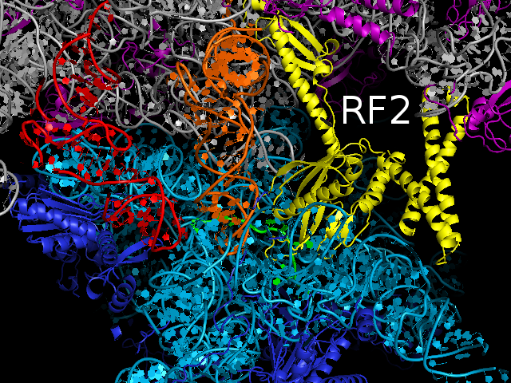
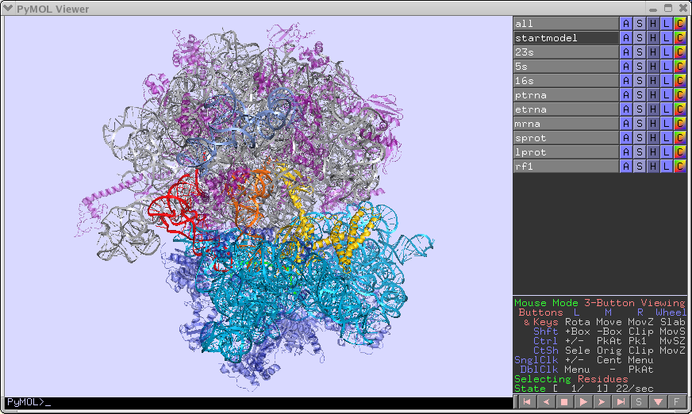
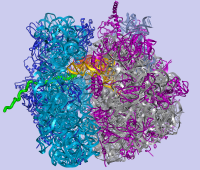
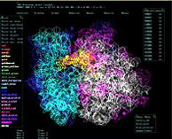
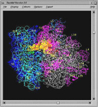

 

> ### 3.0 Å RF2 bound 70S Termination Complex
[{:class="thumbnail-img"}](http://rna.ucsc.edu/rnacenter/pdb/70S_RF2.pdb.tgz) [70S_RF2.pdb.tgz (13 MB) | *(updated 12/8/2008)*](http://rna.ucsc.edu/rnacenter/pdb/70S_RF2.pdb.tgz)  
The [PDB file](http://rna.ucsc.edu/rnacenter/pdb/70S_RF2.pdb.tgz) contains the two 70S ribosome copies in the crystallographic asymmetric unit. Each copy includes the 30S and 50S subunits, messenger RNA, P- and E-site tRNA and release factor 2 bound in the A site in response to a UAA stop codon on the mRNA.  
The [MTZ file](http://rna.ucsc.edu/rnacenter/rf2paper/70S_RF2.mtz.tgz) contains the structure factor amplitudes against which the model was refined.  When using these files, please reference:
- A. Korostelev, H. Asahara, L. Lancaster, M. Laurberg, A. Hirschi, J. Zhu, S. Trakhanov, W.G. Scott and H.F. Noller
- Crystal structure of a translation termination complex formed with release factor RF2.
- Proc Natl Acad Sci U S A. 2008 Dec 16;105(50):19684-9. 
(Epub 2008 Dec 8)  
Protein Data Bank links : [3F1E](http://www.rcsb.org/pdb/search/structidSearch.do?structureId=3F1E) | [3F1F](http://www.rcsb.org/pdb/search/structidSearch.do?structureId=3F1F) | [3F1G](http://www.rcsb.org/pdb/search/structidSearch.do?structureId=3F1G) | [3F1H](http://www.rcsb.org/pdb/search/structidSearch.do?structureId=3F1H) 

> ### 3.2 Å RF1 bound 70S Termination Complex
[{:class="thumbnail-img"}](http://rna.ucsc.edu/rnacenter/pdb/70S_RF1.pdb.tgz) [{:class="thumbnail-img"}](http://rna.ucsc.edu/rnacenter/pdb/70S_RF1.pdb.tgz) [70S_RF1.pdb.tgz (13 MB) | *(updated 8/20/2008)*](http://rna.ucsc.edu/rnacenter/pdb/70S_RF1.pdb.tgz)  
The [PDB file](http://rna.ucsc.edu/rnacenter/pdb/70S_RF1.pdb.tgz) contains the two 70S ribosome copies in the crystallographic asymmetric unit. Each copy includes the 30S and 50S subunits, messenger RNA, P- and E-site tRNA and release factor 1 bound in the A site in response to a UAA stop codon on the mRNA.  
The [MTZ file](http://rna.ucsc.edu/rnacenter/rf2paper/70S_RF2.mtz.tgz) contains the structure factor amplitudes against which the model was refined.  This [PYMOL script](http://rna.ucsc.edu/rnacenter/pdb/70S_RF1.pdb.tgz) provides easy means of inspecting the structure.  When using these files, please reference:
- M. Laurberg, H. Asahara, A. Korostelev, S. Trakhanov and H.F. Noller (2008) 
- Structural basis for translation termination on the 70S ribosome. 
Nature 454, 852-857 (14 August 2008)  
[abstract](http://www.nature.com/nature/journal/v454/n7206/abs/nature07115.html) | [full text](http://www.nature.com/nature/journal/v454/n7206/full/nature07115.html) | [pdf](http://www.nature.com/nature/journal/v454/n7206/pdf/nature07115.pdf) | [supplementary information](http://www.nature.com/nature/journal/v454/n7206/extref/nature07115-s1.pdf) | [more images](http://rna.ucsc.edu/rnacenter/rf1paper/) | [CNS Stack add-on](http://rna.ucsc.edu/pub/stack.tar)  Protein Data Bank links : [3D5A](http://www.rcsb.org/pdb/search/structidSearch.do?structureId=3D5A) | [3D5B](http://www.rcsb.org/pdb/search/structidSearch.do?structureId=3D5B) | [3D5C](http://www.rcsb.org/pdb/search/structidSearch.do?structureId=3D5C) | [3D5D](http://www.rcsb.org/pdb/search/structidSearch.do?structureId=3D5D) 

> ### 3.7 Å 70S Ribosome PDB
[{:class="thumbnail-img"}](http://rna.ucsc.edu/rnacenter/pdb/70S_ribosome3.7A_model140.pdb.gz) [70S_ribosome3.7A_model140.pdb.gz (2.3 MB) | *(updated 4/23/2007)*](http://rna.ucsc.edu/rnacenter/pdb/70S_ribosome3.7A_model140.pdb.gz)  
This PDB file contains the entire 70S ribosome, including the 30S subunit (16S rRNA and small subunit proteins), 50S subunit (23S rRNA, 5S rRNA, and large subunit proteins), P- and E-site tRNA, and messenger RNA.  *When using these files, please reference:*
- A. Korostelev, S. Trakhanov, M. Laurberg and H.F. Noller (2006) Crystal Structure of a 70S Ribosome-tRNA Complex Reveals Functional 
- Interactions and Rearrangements. Cell 126:1065–1077.  
[summary](http://www.cell.com/content/article/abstract?uid=PIIS0092867406011469) | [full text](http://www.cell.com/content/article/fulltext?uid=PIIS0092867406011469) | [pdf](http://download.cell.com/pdfs/0092-8674/PIIS0092867406011469.pdf) 

> ### 5.5 Å 70S Ribosome PDB files
[{:class="thumbnail-img"}](http://rna.ucsc.edu/rnacenter/pdb/pdb1gix.ent) [pdb1gix.ent (880 KB)](http://rna.ucsc.edu/rnacenter/pdb/pdb1gix.ent)  
This PDB file contains the 30S subunit including 16S rRNA, small subunit proteins, A-, P- and E-site tRNA, and messenger RNA. A [summary of the chain IDs and sequence](http://www.rcsb.org/pdb/cgi/explore.cgi?pdbId=1GIX) are available at the RCSB.   [pdb1giy.ent (555 KB)](http://rna.ucsc.edu/rnacenter/pdb/pdb1giy.ent)  This PDB file contains the 50S subunit including 23S rRNA and large subunit proteins as well as the 5S rRNA. A [summary of the chain IDs and sequence](http://www.rcsb.org/pdb/cgi/explore.cgi?pdbId=1GIY) are available at the RCSB. 

> ### PDB files and macros for viewing the Ribosome in 'O'
[{:class="thumbnail-img"}](http://rna.ucsc.edu/rnacenter/misc/ribosome.tar.gz) [ribosome.tar.gz (1.25 MB)](http://rna.ucsc.edu/rnacenter/misc/ribosome.tar.gz)  
A package of 70S ribosome PDB coordinate files, macros and instructions necessary to build a complete complex in O.  [70S.odb.gz (800 KB)](http://rna.ucsc.edu/rnacenter/misc/70s.odb.gz)  A 70S database prebuilt for O version 8.0.6.   See the ['O' Home Page](http://alpha2.bmc.uu.se/~gerard/manuals/) at the Uppsala Software Factory for more information about the program O. 

> ### PDB files and macros for viewing the Ribosome in 'RasMol'
[{:class="thumbnail-img"}](http://rna.ucsc.edu/rnacenter/misc/rasmol.tar.gz) [rasmol.tar.gz (260 KB) ](http://rna.ucsc.edu/rnacenter/misc/rasmol.tar.gz)  
A package containing a 70S PDB file suitable for RasMol, and scripts for coloring and labeling. The model can be displayed using the "backbone" display command or menu option in Rasmol.   See the [Rasmol Home Page](http://www.umass.edu/microbio/rasmol/index2.htm) maintained by Dr. Eric Martz at the University of Massachusetts Amherst for more information about RasMol, RasMac, and RasWin. 