 

All fullsize images are 300 pixels/inch and suitable for high resolution reproduction. All TIFF images use the CMYK color gamut, are are LZW compressed. All JPEG images use the RGB color gamut and have minimal compression

### **Ribosome Secondary Structure**

> **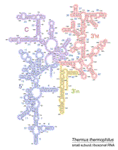{:class="thumbnail-img"} [JPG](images/figs/thermus_16s_2ndry.jpg) | [TIFF](images/figs/thermus_16s_2ndry.tif) | [PDF](images/figs/thermus_16s_2ndry.pdf)** 
Thermus thermophilus 16S rRNA Secondary Structure 
(E. coli numbering) 

> **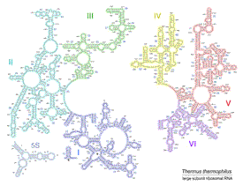{:class="thumbnail-img"} [JPG](images/figs/thermus_23s_2ndry.jpg) | [TIFF](images/figs/thermus_23s_2ndry.tif) | [PDF](images/figs/thermus_23s_2ndry.pdf)** 
Thermus thermophilus 23S 
rRNA Secondary Structure 
(E. coli numbering) 

> **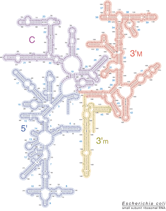{:class="thumbnail-img"} [JPG](images/figs/ecoli_16s.jpg) | [TIFF](images/figs/ecoli_16s.tif) | [PDF](images/figs/ecoli_16s.pdf)** 
Escherichia coli 16S 
rRNA Secondary Structure 

> **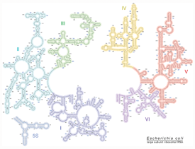{:class="thumbnail-img"} [JPG](images/figs/ecoli_23s.jpg) | [TIFF](images/figs/ecoli_23s.tif) | [PDF](images/figs/ecoli_23s.pdf)** 
Escherichia coli 23S 
rRNA Secondary Structure 

### **Ribosome Tertiary Structure**

> **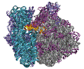{:class="thumbnail-img"} [JPG](images/figs/70s_atrna_nolabels.jpg) | [TIFF](images/figs/70s_atrna_cymk_nolabels.tif)** 
70S Ribosome (right side view)

> **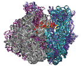{:class="thumbnail-img"} [JPG](images/figs/70s_etrna_nolabels.jpg) | [TIFF](images/figs/70s_etrna_cymk_nolabels.tif)** 
70S Ribosome (left side view)

> **{:class="thumbnail-img"} [JPG](images/figs/70s_atrna_labels.jpg) | [TIFF](images/figs/70s_atrna_cmyk_labels.tif)** 
70S Ribosome (right side view) 
with labels

> **{:class="thumbnail-img"} [JPG](images/figs/70s_etrna_cmyk_labels.jpg) | [TIFF](images/figs/70s_etrna_cmyk_labels.tif)** 
70S Ribosome (left side view) 
with labels

> **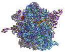{:class="thumbnail-img"} [JPG](images/figs/70s_30s_cymk_nolabels.jpg) | [TIFF](images/figs/70s_30s_cymk_nolabels.tif)** 
70S Ribosome (30S view) 

> **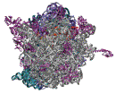{:class="thumbnail-img"} [JPG](images/figs/70s_50s_cymk_nolabels.jpg) | [TIFF](images/figs/70s_50s_cymk_nolabels.tif)** 
70S Ribosome (50S view)

> **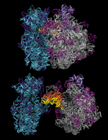{:class="thumbnail-img"} [JPG](images/figs/70s_openbook_nolabels.jpg) | [TIFF](images/figs/70s_openbook_nolabels.tif)** 
70S Ribosome (open book view)

> **{:class="thumbnail-img"} [JPG](images/figs/50s_30s_labels.jpg) | [TIFF](images/figs/50s_30s_labels.tif)** 
Interface views of the 
50S (left) and 30S (right) 
ribosomal subunits. 
with labels 

### **Publication Covers**

> **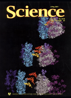{:class="thumbnail-img"}** 
2001 Science Cover 

> **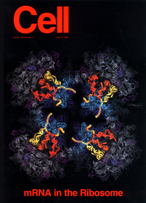{:class="thumbnail-img"}** 
2001 Cell Cover 

> **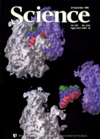{:class="thumbnail-img"}** 
1999 Science Cover  

> **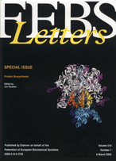{:class="thumbnail-img"}** 
2002 FEBS Letters Cover 
   
   