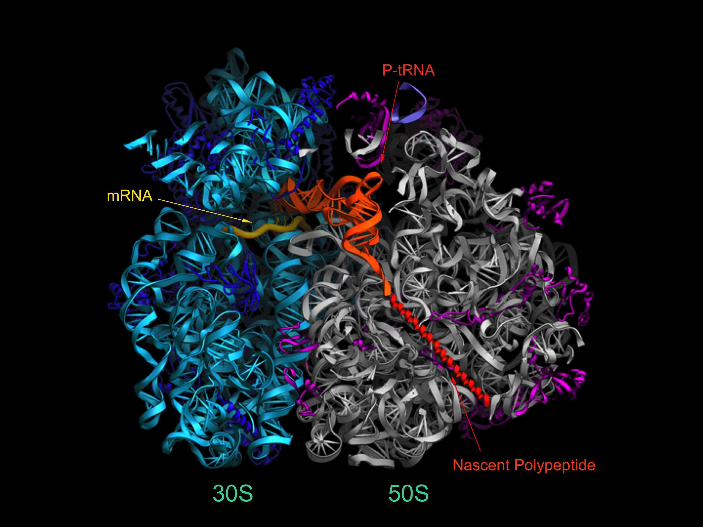
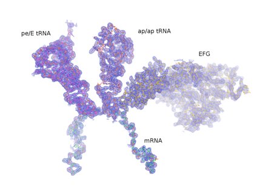
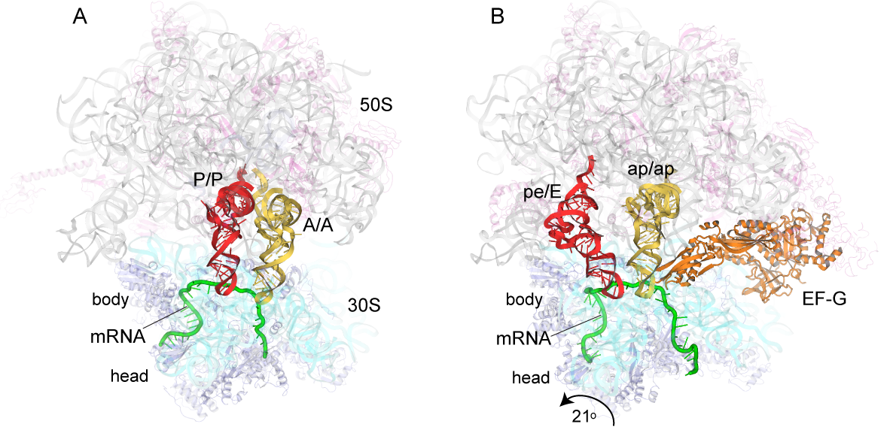
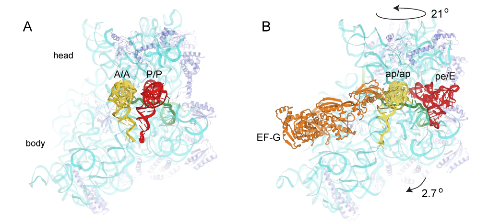
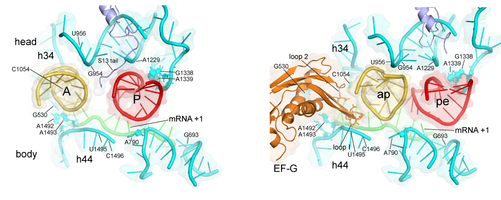

 

****

<figure class="figure">
  
  <figcaption class="figure-caption">Cross-section of the T. thermophilus 70S ribosome showing the locations of the mRNA and tRNAs in the intersubunit cavity.
Electron density of tRNA and mRNA in intermediate state Electron density map for the mRNA, tRNAs and elongation factor EF-G from the crystal structure of a trapped chimeric hybrid-state translocation intermediate (Zhou et al., 2014)</figcaption>
</figure>

****

The ribosome is a very large (~2.5 MDa) cellular ribonucleoprotein complex responsible for translation of the genetic code, and synthesis of proteins in all organisms. The Noller lab uses a wide range of experimental and computational approaches, including x-ray crystallography, single-molecule FRET, genetics and biochemistry to study the structure and mechanisms of action of this ancient macromolecular machine. Most intriguing is the overwhelming evidence that the core biological functions of the ribosome, including aminoacyl-tRNA selection, peptide bond formation and translocation, are based on its ribosomal RNA (rRNA).

****

<figure class="figure">
  
  <figcaption class="figure-caption">Electron density map for the mRNA, tRNAs and elongation factor EF-G from the crystal structure of a trapped chimeric hybrid-state translocation intermediate (Zhou et al., 2014)</figcaption>
</figure>

****

An example of a current area of investigation is to understand the mechanism of translocation - the coupled movement of mRNA and tRNA through the ribosome during the elongation phase of protein synthesis. How are the tRNAs, with molecular weights of ~25 kDa, transported precisely through the ribosome at rates of ~20 sec-1 over distances of 20-70 Å ? And how is this accomplished while rigorously maintaining the translational reading frame? The first indications are that translocation is driven by movement of structural elements of the ribosome itself. This view raises further questions: what are the ribosome's moving parts, how do they move, how are these movements coordinated and how do they enable the mechanisms of translocation? One approach to understanding the structural dynamics of the ribosome is to determine crystal structures of the ribosome trapped in intermediate states of translocation. Another approach is the use of Förster resonance energy transfer (FRET) - to watch the movements of fluorescent labels attached to specific positions of the ribosome structure during translocation in real time. We are also using computationally-based comparative structural analysis to understand the stereochemical basis of ribosome structural dynamics. Mechanistic models are then tested by directed mutagenesis of key structural elements. The emerging view is that the unique dynamic properties of RNA may account for its participation in the core functions of the ribosome.

****

<figure class="figure">
  
  <figcaption class="figure-caption">Positions of tRNAs in (A) the classical-state ribosome (Jenner et al., 2010) and (B) a trapped chimeric hybrid-state translocation intermediate (Zhou et al., 2014).</figcaption>
</figure>

****

<figure class="figure">
  
  <figcaption class="figure-caption">Positions of tRNAs in (A) the classical-state ribosome (Jenner et al., 2010) and (B) a trapped chimeric hybrid-state translocation intermediate, showing contact between domain IV of EF-G and the mRNA and ap/ap chimeric hybrid-state tRNA (Zhou et al., 2014).</figcaption>
</figure>

****

A working model is that in the first step of translocation, the tRNAs move relative to the large ribosomal subunit. In this step, the acceptor end of the A-site and P-site tRNAs move into the P and E sites, respectively, of the large subunit, creating the A/P and P/E hybrid states. This step can proceed spontaneously, driven purely by thermal energy, and is reversible. In the second step, the mRNA and the anticodon ends of the tRNAs move relative to the small ribosomal subunit, creating the classical P/P and E/E states, completing translocation.  Head Rotation Positions of tRNAs in (A) the classical-state ribosome (Jenner et al., 2010) and (B) a trapped chimeric hybrid-state translocation intermediate, showing contact between domain IV of EF-G and the mRNA and ap/ap chimeric hybrid-state tRNA (Zhou et al., 2014). This step is the main kinetic and thermodynamic barrier to translocation, and is overcome by elongation factor EF-G, a GTPase. The first step is accompanied by rotation of the small subunit relative to the large subunit, and the second step by rotation of the head domain of the small subunit. However, in spite of considerable progress on this problem, many fundamental questions remain unanswered, including: What is responsible for the energy barrier to the second step of translocation that is overcome by EF-G and GTP? How does EF-G overcome this barrier? How do the 30S subunit head and body reverse without reversing tRNA movement? What is "the ratchet"? What is the pawl of the ratchet? Does EF-G bind to the classical or hybrid state? What does GTP hydrolysis accomplish? How does EF-G promote intersubunit and head rotation? What prevents shifting of the translational reading frame during translocation? Is mRNA actively translocated, or is it moved by its association with tRNA? And, how is movement of all of the various structural elements coordinated?

****

<figure class="figure">
  
  <figcaption class="figure-caption">Contacts between the 30S ribosomal subunit and tRNAs in (A) the classical-state ribosome (Jenner et al., 2010) and (B) a trapped chimeric hybrid-state translocation intermediate, showing movement of the tRNAs following the rotational movement of the 30S head domain, and domain IV of EF-G (Zhou et al., 2014).
</figcaption>
</figure>

****

Besides translocation, other current areas of investigation in the Noller lab include: the mechanism of action of the mRNA helicase activity of the ribosome; the mechanism of translation termination; the forces exerted by the ribosome during protein synthesis (in collaboration with the Tinoco and Bustamante labs at UCB); and the mechanism of translation initiation by IRES elements (in collaboration with the Kieft lab at the Univ. of Colorado).

###Selected Recent Publications:

> Colussi TM, Costantino DA, Zhu J, Donohue JP, Korostelev AA, Jaafar ZA, Plank TD,
Noller HF, Kieft JS. 
[Initiation of translation in bacteria by a structured eukaryotic IRES RNA.](http://www.ncbi.nlm.nih.gov/pubmed/25652826) 
Nature. 2015 Feb 4. Nature 519:110-113. 

> Zhou, J., Lancaster, L., Donohue, J.P. and Noller, H.F. 2014.  
How the ribosome hands the A-site tRNA to the P site during EF-G-catalyzed translocation.  
Science 345:1188-1191.

> Mohan, S., Donohue, J.P and Noller, H.F. 2014.  
Molecular mechanics of 30S subunit head rotation.  
Proc Natl Acad Sci U S A 111:13225-13230.

> Liu, T., Kaplan, A., Wickersham, C.E., Wen, J.-D., Alexander, L., Lancaster, L., Fredrick, K., Noller, H.F., Tinoco, I. Jr. and Bustamante, C. 2014.  
Direct Measurement of the Mechanical Work During Translocation by the Ribosome.  
eLife 3:e03406.

> Ramrath, D.J.F., Lancaster, L., Sprink, T., Mielke, T., Loerke, J., Noller, H.F. and Spahn, C.M.T. 2013.  
Visualization of two tRNAs trapped in transit during EF-G-mediated translocation.  
Proc Natl Acad Sci U S A 110:20964-20969.

> Noller, H.F. 2013.  
How does the ribosome sense a cognate tRNA?  
J. Mol. Biol. 425:3776-3777.

> Zhou, J., Lancaster, L., Donohue, J.P. and Noller, H.F. 2013.  
Crystal Structures of EF-G-Ribosome Complexes Trapped in Intermediate States of Translocation.  
Science 340:1236086

> Santos, N., Zhu, J., Donohue, J.P., Korostelev, A.A. and Noller, H.F. 2013.  
Crystal structure of the 70S ribosome bound with the Q253P mutant form of release factor RF2.  
Structure 21:1258-1263.

> Guo, Z. and Noller, H.F. 2012.  
Rotation of the head of the 30S ribosomal subunit during mRNA translocation.  
Proc Natl Acad Sci U S A 109:20391-20394.

> Zhou, J., Korostelev, A., Lancaster, L. and Noller, H.F. 2012.   
Crystal Structures of 70S Ribosomes bound to release factors RF1, RF2 and RF3.  
Curr Opin Struct Biol. 2012 22:733-742

> Qu, X., Lancaster, L., Noller, H.F., Bustamante, C., and Tinoco, I., Jr. 2012.   
Ribosomal protein S1 unwinds double-stranded RNA in multiple steps.   
Proc Natl Acad Sci USA 109:14458-14463.

> Zhou, J., Lancaster, L., Trakhanov, S. and Noller, H.F. 2011.  
Crystal Structure of Release Factor RF3 Trapped in the GTP state on a rotated conformation of the ribosome.  
RNA 18:230-240.

> Qu, X., Wen, J.D., Lancaster, L., Noller, H.F., Bustamante, C., and Tinoco, I., Jr. 2011.  
The ribosome uses two active mechanisms to unwind messenger RNA during translation.  
Nature 475: 118-121.

> Zhu, J., Korostelev, A., Costantino, D.A., Donohue, J.P., Noller, H.F. and Kieft, J.S. 2011.  
Crystal structures of complexes containing domains from two viral internal ribosome entry site (IRES) RNAs bound to the 70S ribosome.  
Proc Natl Acad Sci USA 108:1839-1844.

> Ermolenko, D.N. and Noller, H.F. 2011.  
mRNA Translocation Occurs During the Second Step of Ribosomal Intersubunit Rotation.  
Nat Struct Mol Biol 18:457-462.

> Korostelev, A., Zhu, J., Asahara, H. and Noller, H.F. 2010.  
Recognition of the amber UAG stop codon by release factor RF1.  
EMBO J 29:2577-85.

> Korostelev, A., Laurberg, M., and Noller, H.F. 2009.  
Multistart simulated annealing refinement of the crystal structure of the 70S ribosome.  
Proc Natl Acad Sci USA 106:18195-18200.

> Cornish, P.V., Ermolenko, D.N., Staple, D.W., Hoang, L., Hickerson, R., Noller, H.F. and Ha, T. 2009.  
Following Movement of the L1 Stalk Between Three Functional States in Single Ribosomes.  
Proc Natl Acad Sci USA 106:2571-2576.

> Korostelev, A., Asahara, H., Lancaster, L., Laurberg, M. Hirschi, A., Zhu, J., Trakhanov, S., Scott, W. and Noller, H.F. 2008.  
Crystal Structure of a Translation Termination Complex Formed with Release Factor RF2.  
Proc Natl Acad Sci USA 105:19684-19689.

> Korostelev, A., Ermolenko, D.N. and Noller, H.F. 2008.  
Structural Dynamics of the Ribosome.  
Curr Opin Chem Biol 12:674-83

> Lancaster, L., Lambert, N.J., Maklan, E.J., Horan, L.H and Noller, H.F. 2008.  
The sarcin-ricin loop of 23S rRNA is essential for assembly of the functional core of the 50S ribosomal subunit.  
RNA 14:1-14.

> Laurberg, M., Asahara, H., Korostelev, A., Zhu, J., Trakhanov, S. and Noller, H.F. 2008.  
Structural basis for translation termination on the 70S ribosome.  
Nature 454(14):852-857.

> Wen, J.D., Lancaster, L., Hodges, C., Zeri, A.C., Yoshimura, S.H., Noller, H.F., Bustamante, C., and Tinoco, I. 2008.  
Following translation by single ribosomes one codon at a time.  
Nature 452(7187):598-603.

> Cornish, P.V., Ermolenko, D.N., Noller, H.F., and Ha, T. 2008.  
Spontaneous intersubunit rotation in single riboomes.  
Mol Cell 30(5):578-88.

> Korostelev, A., Trakhanov, S., Asahara, H., Laurberg, M., Lancaster, L. and Noller, H.F. 2007.  
Interactions and dynamics of the Shine-Dalgarno helix in the 70S Ribosome.  
Proc Natl Acad Sci USA 104:16840-16843.

> Ermolenko, D.N., Majumdar, Z.K., Hickerson, R.P., Spiegel, P.C., Clegg, R.M., and Noller, H.F. 2007.  
Observation of intersubunit movement of the ribosome in solution using FRET.  
J Mol Biol 340:530-540.

> Ermolenko, D.N., Spiegel, P.C., Majumdar, Z.K., Hickerson, R.P., Clegg, R.M., and Noller, H.F. 2007.  
The antibiotic viomycin traps the ribosome in an intermediate state of translocation.  
Nat Struct Mol Biol. 6:493-7.

> Spiegel, P.C., Ermolenko, D.N., and Noller, H.F. 2007.  
Elongation factor G stabilizes the hybrid-state conformation of the 70S ribosome.  
RNA 13:1473-1482.

