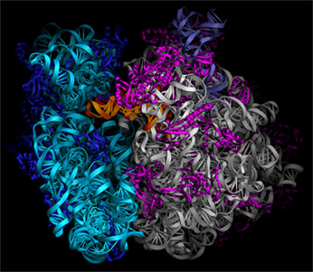

 

{:class="rounded float-right"} Ribosomes are ancient molecular machines that are responsible for production of protein in all living cells. They are large (2.5 MD molecular weight or larger) macromolecular complexes composed of RNA (2/3) and protein (1/3). Ribosomes read the nucleotide sequence of a messenger RNA (mRNA) into a protein sequence, using the genetic code. They use transfer RNAs (tRNAs) to mediate this process of translation from the nucleotide language of RNA and DNA into the amino acid language of proteins. 

Cells typically contain many thousands of ribosomes. Each ribosome can bind one mRNA and up to three tRNAs. Each new amino acid is brought into the ribosome as an aminoacyl-tRNA, by elongation factor EF-Tu. The nascent protein chain is transferred from a peptidyl-tRNA to the newly introduced aminoacyl-tRNA in a reaction catalyzed by peptidyl transferase, an enzymatic activity that is part of the structure of the ribosome. Elongation factor EF-G catalyzes the movement of tRNA and mRNA through the ribosome during translation.

{:class="rounded float-left"}In the Noller laboratory, the structure of the complete Thermus thermophilus 70S ribosome was crystallized in a complex containing mRNA and two or three tRNAs (bound to the A, P and E sites of the ribosome), and solved by x-ray crystallography to a resolution of 5.5 Å (Cate et al., 1999; Yusupov et al., 2001). The path of the mRNA through the ribosome was also determined crystallographically using difference Fourier methods (Yusupova et al., 2001).
