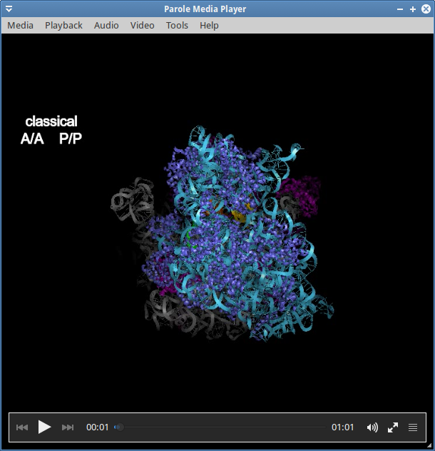
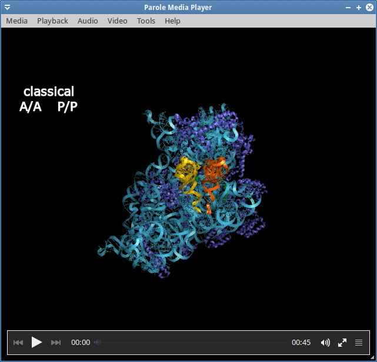
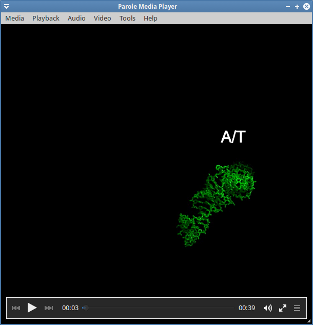
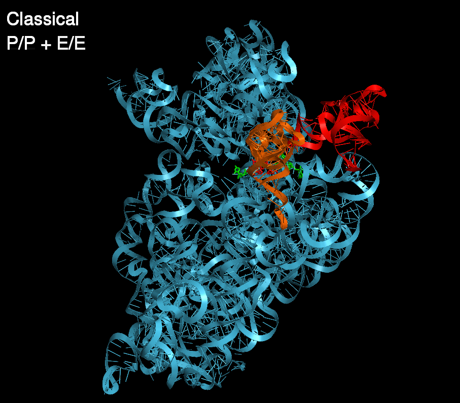
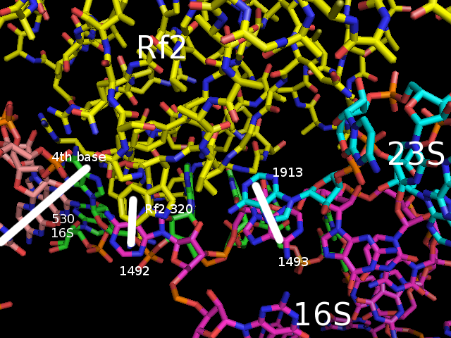
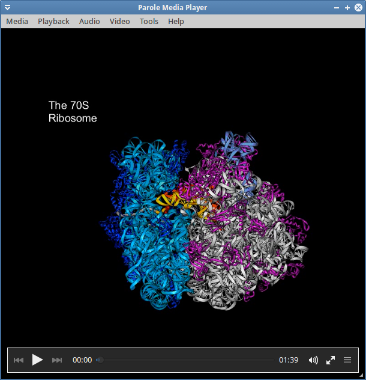
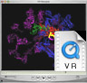

 

> **[{:class="thumbnail-img"}](http://rna.ucsc.edu/rnacenter/movies/ar70s.avi) [avi (24 MB)](http://rna.ucsc.edu/rnacenter/movies/ar70s.avi)  :::** 
Reconstruction of the dynamics of translocation, 70S ribosome

> **[{:class="thumbnail-img"}](http://rna.ucsc.edu/rnacenter/movies/apr30s4.avi) [avi (18.2 MB)](http://rna.ucsc.edu/rnacenter/movies/apr30s4.avi)  :::** 
Reconstruction of the dynamics of translocation, 30S ribosome

> **[{:class="thumbnail-img"}](http://rna.ucsc.edu/rnacenter/movies/trnaflexapr.avi) [avi (3.4 MB)](http://rna.ucsc.edu/rnacenter/movies/trnaflexapr.avi) :::** 
Reconstruction of the dynamics and flexing of tRNA during translocation of the ribosome

> **[{:class="thumbnail-img"}](http://rna.ucsc.edu/rnacenter/movies/tRNA_translocation.avi) [avi (12 MB)](http://rna.ucsc.edu/rnacenter/movies/tRNA_translocation.avi) :::** 
Reconstruction of the dynamics of translocation of tRNA through the ribosome based on 4 crystal structures

> **[{:class="thumbnail-img"}](http://rna.ucsc.edu/rnacenter/movies/rf2wint.avi) [avi (3.1 MB)](http://rna.ucsc.edu/rnacenter/movies/rf2wint.avi) :::** 
Rf2 with mRNA and selected 16S and 23S nucleotides. The movie shows a morph of closed Rf2 into open Rf2 with developement of interaction sites.

> **[{:class="thumbnail-img"}](http://rna.ucsc.edu/rnacenter/movies/Translation3.avi) [avi (2.7 MB)](http://rna.ucsc.edu/rnacenter/movies/Translation3.avi) :::** 
Translation movie showing the proposed movement of the A-, P- and E-site tRNA's during translocation and elongation 

> **[{:class="thumbnail-img"}](http://rna.ucsc.edu/rnacenter/movies/70s_sm.avi) [Small 349x261 (9.7 MB) ](http://rna.ucsc.edu/rnacenter/movies/70s_sm.avi) ::: [Large 700x525 (37 MB)](http://rna.ucsc.edu/rnacenter/movies/70s.avi)** 
A 360 degree rotation of the 70S ribosome, tRNAs and mRNA. 

> **[{:class="thumbnail-img"}](http://rna.ucsc.edu/rnacenter/movies/70s_vr.avi) [624x500 (55 MB)](http://rna.ucsc.edu/rnacenter/movies/70s_vr.avi) :::** 
A Quicktime VR movie of the ribosome. Dragging in the horizontal axis rotates the model while dragging in the vertical axis changes which portions of the ribosome are displayed.

> **[{:class="thumbnail-img"}](http://rna.ucsc.edu/rnacenter/movies/hybrid.avi) [640x480 (2.6 MB)](http://rna.ucsc.edu/rnacenter/movies/hybrid.avi) :::** 
A Hybrid states movie showing the proposed movement of the A-, P- and E-site tRNA's during translocation and elongation.

> **[{:class="thumbnail-img"}](http://rna.ucsc.edu/rnacenter/movies/30s_states.avi) [624x500 (28MB)](http://rna.ucsc.edu/rnacenter/movies/30s_states.avi) :::** 
Three conformational states of the 30S subunit based on x-ray structures of the 30S as part of the 70S complex, and crystallized alone in the presence of tRNA anticodon stem loops and antibotics.

