> ### Ribosome Structure and Function
**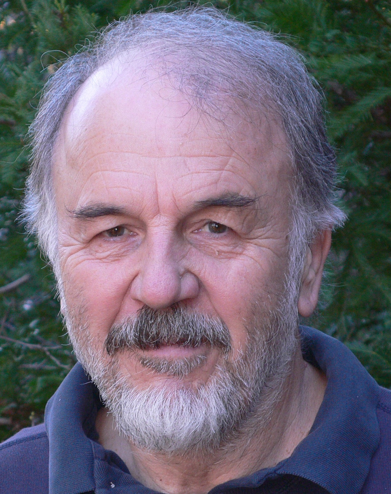{:class="profile-img"} [Harry F. Noller](https://mcd.ucsc.edu/faculty/noller.html) | [lab website](noller-lab.html) | [pubs](noller-lab-pubs.html) | [email](harry@nuvolari.ucsc.edu)**
- Director, Center for Molecular Biology of RNA.  
- Robert L. Sinsheimer Professor of Molecular Biology.   
- Professor of Molecular, Cell and Developmental Biology.

> ### RNA Splicing
**{:class="profile-img"} [Manuel Ares, Jr.](http://ribonode.ucsc.edu) | [lab website](http://ribonode.ucsc.edu) | [pubs](https://www.ncbi.nlm.nih.gov/pubmed?cmd=Search&term=Ares%20M%20RNA%20or%20Ares%20M%20intron%20or%20Ares%20M%20splicing%20or%20Ares%20M%20Tetrahymena%20or%20Ares%20M%20teaching%20butnot%20Ares%20MP) | [email](mailto:ares@ucsc.edu)** 
Professor of Molecular, Cell and Developmental Biology. 

> ### Regulation of Alternative Splicing
**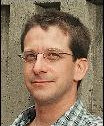{:class="profile-img"} [Alan M. Zahler ](http://bio.research.ucsc.edu/people/zahler/index.html) | [lab website](http://bio.research.ucsc.edu/people/zahler/index.html) | [pubs](http://bio.research.ucsc.edu/people/zahler/pubs.html) | [email](mailto:zahler@biology.ucsc.edu)** 
Professor of Molecular, Cell and Developmental Biology.

> ### Non-coding RNA gene finders and experimental genomics
**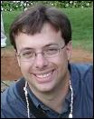{:class="profile-img"} [Todd Lowe](http://lowelab.ucsc.edu/) | [lab website](http://lowelab.ucsc.edu/) | [email](mailto:lowe@soe.ucsc.edu)** 
Professor of Biomolecular Engineering.

> ### Genomics and Bioinformatics
**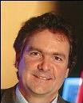{:class="profile-img"} [David Haussler](https://genomics-old.soe.ucsc.edu/haussler) | [lab website](https://genomics-old.soe.ucsc.edu/haussler) | [email](mailto:haussler@soe.ucsc.edu)** 
Professor of Biomolecular Engineering.

> ### Structural Approaches To Large Macromolecular Complexes
**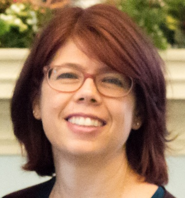{:class="profile-img"} [Melissa Jurica](http://bio.research.ucsc.edu/people/jurica/) | [lab website](http://bio.research.ucsc.edu/people/jurica/) | [pubs](http://www.ncbi.nlm.nih.gov/entrez/query.fcgi?CMD=search&DB=pubmed&term=jurica+ms) | [email](mailto:jurica@biology.ucsc.edu)** 
Professor of Molecular, Cell and Developmental Biology.

> ### RNA Structure, Function and Catalysis
**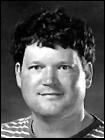{:class="profile-img"} [William G. Scott](http://xanana.ucsc.edu/scottlab/) | [lab website](http://xanana.ucsc.edu/scottlab/) | [pubs](http://xanana.ucsc.edu/scottlab/pubs.html) | [email](mailto:wgscott@chemistry.ucsc.edu)** 
Professor of Chemistry and Biochemistry.

> ### Post-transcriptional control of gene expression
**{:class="profile-img"} [Jeremy Sanford](http://www.mcd.ucsc.edu/faculty/sanford.html) | [lab website](http://www.mcd.ucsc.edu/faculty/sanford.html) | [pubs](http://www.ncbi.nlm.nih.gov/sites/entrez?cmd=PureSearch&db=pubmed&term=sanford+jr[au]) | [email](mailto:jeremyrsanford@gmail.com)** 
Associate Professor of Molecular, Cell and Developmental Biology. 

> ### Single-molecule Biophysics and Enzymology
**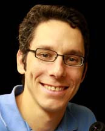{:class="profile-img"} [Michael Stone](http://stone.chemistry.ucsc.edu/) | [lab website](http://stone.chemistry.ucsc.edu/) | [pubs](http://stone.chemistry.ucsc.edu/index.php/publications/) | [email](mailto:mds@ucsc.edu)** 
Associate Professor of Chemistry. 

> ### Somatic Mutations that cause changes to the Transcriptome
**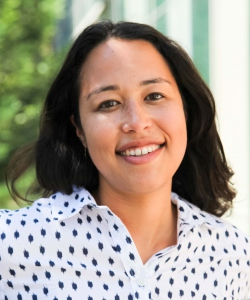{:class="profile-img"} [Angela Brooks](https://www.soe.ucsc.edu/people/brooks) | [lab website](https://www.soe.ucsc.edu/people/brooks) | [pubs](https://brookslab.soe.ucsc.edu/?page_id=7) | [email](mailto:anbrooks@ucsc.edu)** 
Assistant Professor of Biomolecular Engineering. 

> ### Innate Immune Responses to Infection
**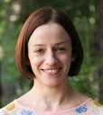{:class="profile-img"} [Susan Carpenter](http://mcd.ucsc.edu/faculty/carpenter.html) | [lab website](http://mcd.ucsc.edu/faculty/carpenter.html) | [pubs](https://sites.google.com/a/ucsc.edu/carpenter-lab/publications) | [email](mailto:sucarpen@ucsc.edu)** 
Assistant Professor of Molecular, Cell and Developmental Biology. 

> ### Epigenomic reprogramming by long noncoding RNA
**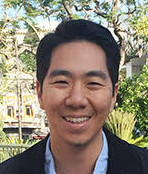{:class="profile-img"} [Daniel H. Kim](http://www.soe.ucsc.edu/people/dkim) | [lab website](http://www.soe.ucsc.edu/people/dkim) | [pubs](https://sites.google.com/a/ucsc.edu/kim-lab/publications) | [email](mailto:daniel.kim@ucsc.edu)** 
Assistant Professor, Biomolecular Engineering 

> ### Nanopore sequencing
**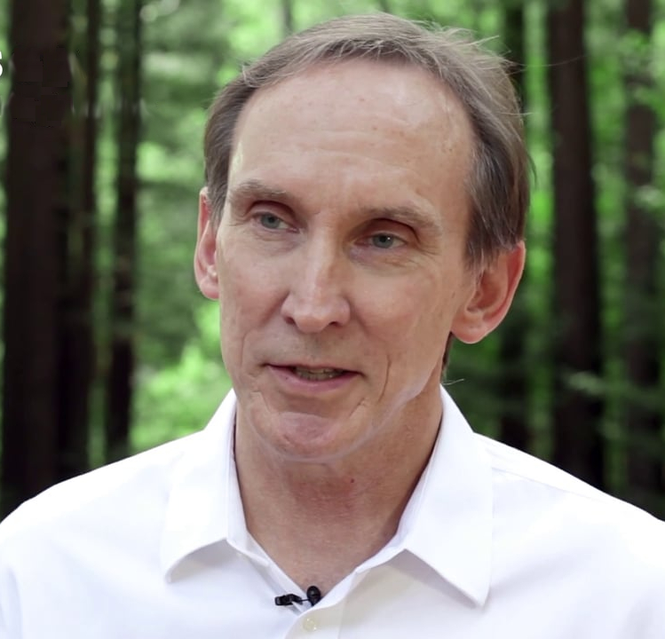{:class="profile-img"} [Mark Akeson](http://www.soe.ucsc.edu/people/makeson) | [lab website](http://www.soe.ucsc.edu/people/makeson) | [pubs](https://cbse.soe.ucsc.edu/people/akeson_pubs) | [email](mailto:makeson@soe.ucsc.edu)** 
Professor, Biomolecular Engineering 

