### Web Servers

- [tRNAscan-SE for tRNA predictions](http://lowelab.ucsc.edu/tRNAscan-SE/)
- [snoscan for C/D box snoRNA predictions](http://lowelab.ucsc.edu/snoscan/)
- [snoGPS for H/ACA snoRNA predictions](http://lowelab.ucsc.edu/snoGPS/)

***

### Databases

- [UCSC Archaeal Genome Browser](http://archaea.ucsc.edu)
- [UCSC Microbial Genome Browser](http://microbes.ucsc.edu)
- [Genomic tRNA Database](http://gtrnadb.ucsc.edu)
- [snoRNA Database for Yeast and Archaea](http://lowelab.ucsc.edu/s)

***

### [Crystallography on OS X](http://scottlab.ucsc.edu/xtal/wiki/index.php/Crystallography_on_OS_X)
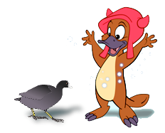{:class="image right software-img"}
Determining the crystal structure of RNA using OSX software.
- [COOT](http://scottlab.ucsc.edu/xtal/wiki/index.php/Stand-Alone_Coot)

***

### Pymol plugins for axis and angle rotation
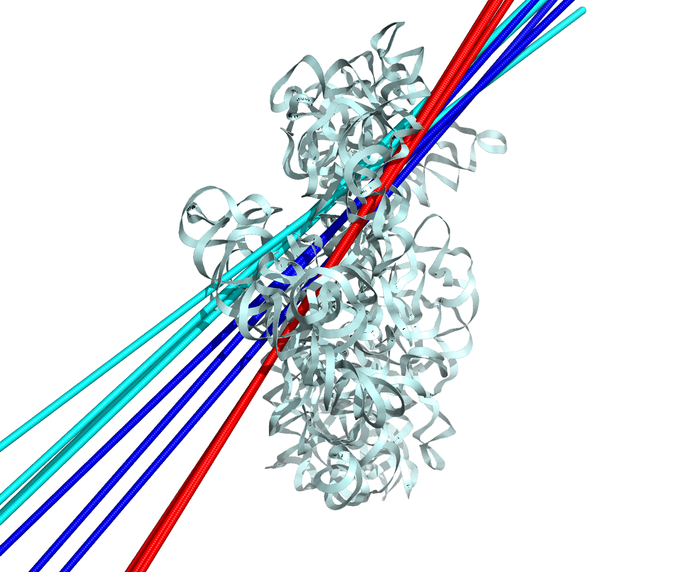{:class="image right software-img"}
- [Pymol plugin for Euler-Rodriguez Transformation calculation of axis and angle or rotation (...save as)](http://rna.ucsc.edu/rnacenter/erodaxis.py)
- [example use of Euler-Rodriguez plugin (...save as)](http://rna.ucsc.edu/rnacenter/erodexampl.pml)
- [Details for Euler-Rodriguez Transformation calculation of axis and angle or rotation](http://rna.ucsc.edu/rnacenter/erod.html)

***

### Pymol plugin for identifying domains

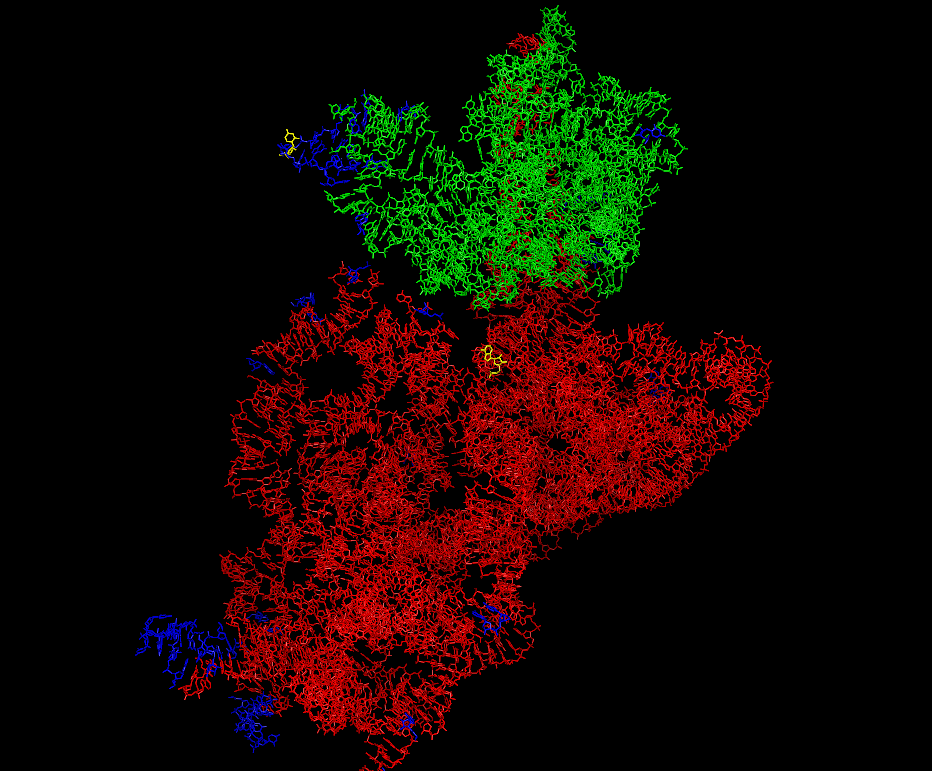{:class="image right software-img"}
[Pymol plugin for identifying domains (...save as)](http://rna.ucsc.edu/rnacenter/simpdomains.py)

***

### [PDB to Restraints](http://rna.ucsc.edu/pdbrestraints/)
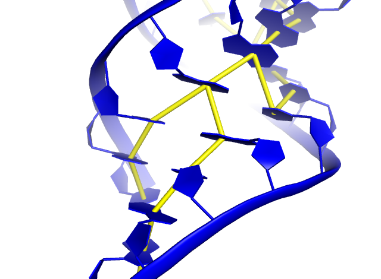{:class="image right software-img"}
[Webserver for generating Stacking and Base Pair restraints](http://rna.ucsc.edu/pdbrestraints/) from a PDB coordinate file.

***

### [PDB to pymol base pair cones](http://rna.ucsc.edu/rnabasepairs/)
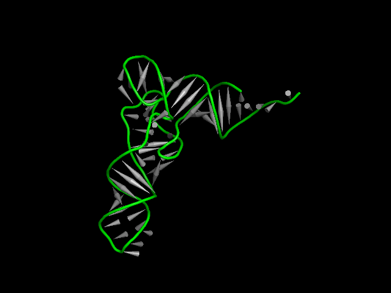{:class="image right software-img"}
Webserver for generating cone type basepairs for pymol. 

***

### [XRNA](http://rna.ucsc.edu/rnacenter/xrna/xrna.html)
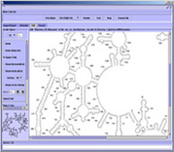{:class="image right software-img"}
Java program for creating, manipulating and annotating secondary structure graphics. 

***

### [XRNA2.0](http://rna.ucsc.edu/xrna2.0/)
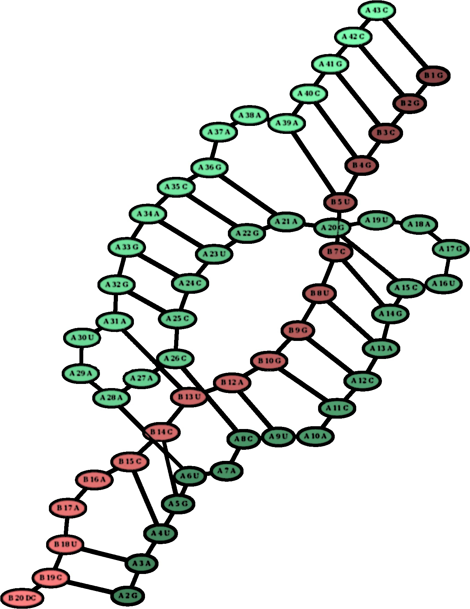{:class="image right software-img"}
(Beta) Webserver for creating, manipulating and annotating secondary structure graphics. It can handle pseudoknots, multiple chains, insertions, deletions

***

### [Intronerator](http://genome-test.cse.ucsc.edu/Intronerator/)
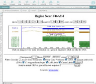{:class="image right software-img"}
A set of web-based tools for exploring RNA splicing and gene structure in Caenorhabditis elegans.

***

### [Ares lab Yeast Intron Database](http://metarray.ucsc.edu/yeast_intron_db/)
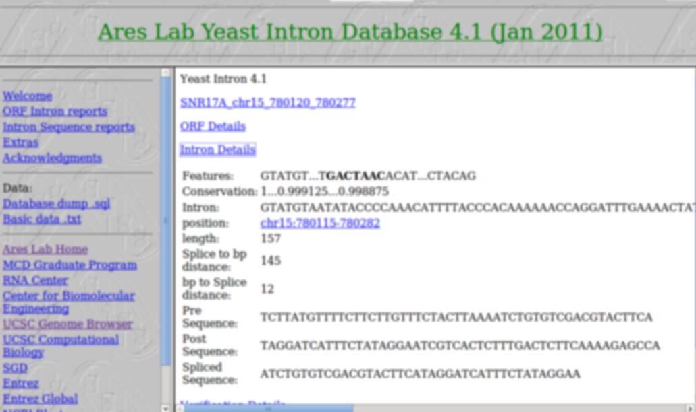{:class="image right software-img"}
Web database lookup tools. 

***

### [Experimental Design and Optimization](http://rna.ucsc.edu/expdesign/)
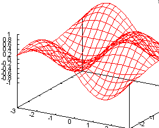{:class="image right software-img"}
Web interface for experimental design and optimization tools. 

***

### [Sequence Logo Generator](http://areslab.ucsc.edu/seqlogo/)
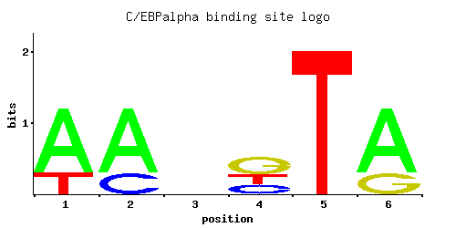{:class="image right software-img"}
Sequence Logo Generator, from PSWM or PSSM . 

***
